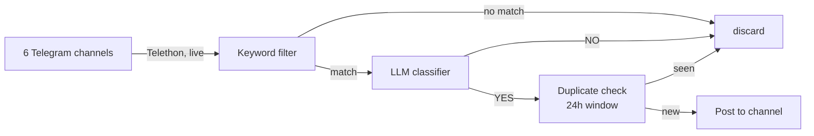

# News Tracker

Watches Ukrainian Telegram news channels and forwards only the posts that describe
**changes to mobilization, conscription, or border-exit rules for men aged 18–22**
into a Telegram channel.

Most Ukrainian news channels post dozens of times a day. This filters that firehose
down to the handful of posts that actually change the rules for one specific group.

## How it works



1. **Read** — [`main.py`](main.py) connects as a *personal Telegram account* (via
   [Telethon](https://docs.telethon.dev/)) and listens for new posts in the channels
   listed in [`channels.py`](channels.py). A personal account is required here: bots
   cannot read channels they don't administer.
2. **Keyword filter** — [`filters.py`](filters.py) does a cheap substring match on word
   stems (`мобілізац`, `відстроч`, `ТЦК`, `кордон`, …), plus a regex for age brackets
   that overlap 18–22 in any format (`18-22`, `від 18 до 60`, `22-річних`). Matching
   brackets by regex rather than by literal string is what lets a post about men
   "18–60" reach the classifier at all. This discards ~99% of posts without spending
   an API call.
3. **Classify** — surviving posts go to an LLM with a prompt that asks one question:
   does this describe a rule change affecting men 18–22? The keyword stage deliberately
   over-matches; this stage removes the false positives. This repo ships configured for
   **Gemini via Google AI Studio** (generous free tier), but the approach is
   provider-agnostic — any LLM API works identically, since it's just "send a prompt,
   parse a YES/NO answer." Swapping providers means replacing the client call in
   `llm_classify()` ([`filters.py`](filters.py)) with that provider's SDK (OpenAI,
   Anthropic Claude, a self-hosted model via Ollama, etc.) — the prompt template,
   keyword pre-filter, and response parsing don't change.
4. **Deduplicate** — [`storage.py`](storage.py) hashes the post and skips anything
   already seen in the last 24 hours, since breaking news gets reposted across channels.
5. **Publish** — [`notifier.py`](notifier.py) posts an excerpt plus a link to the
   original into the destination channel, via a bot.

Every decision (YES and NO, with the model's reasoning) is logged to a local SQLite
database, so the filter's behaviour can be audited after the fact.

## Staying alive

The tracker is a long-running process, so the interesting failure is not "it crashed"
but "it died quietly and nobody noticed." Two independent layers cover that:

| Layer | Catches | How you find out |
|---|---|---|
| **Dead man's switch** ([healthchecks.io](https://healthchecks.io) in this repo) | Server offline, network down, process hung, event loop stuck | The process checks in every 5 minutes. If check-ins stop, the external service messages you. |
| **systemd `ExecStopPost=`** | Process crashed while the server is still up | [`alert_failure.py`](alert_failure.py) DMs you the cause immediately and writes a marker file. On its next successful start, `main.py` sees the marker and sends its own "back up" confirmation — a crash-and-restart is typically over in seconds, far faster than healthchecks.io's ~15 min detection window, so recovery can't wait on Layer 1 for this case. |
| **LLM error tracking** | The LLM API is down or the key is revoked/exhausted — process itself stays alive | Without this, a classifier outage looks identical to "no relevant news today": [`filters.py`](filters.py) would silently log every keyword match as `NO` forever. It alerts after 2 consecutive classification failures (not 1, since only 429s retry in-call — other errors return on the first hiccup, so 1 failure alone could be a fluke) and confirms recovery on the next success. |

The first layer is the important one: a heartbeat *sent by* the app can never report the
app's own death. Inverting it — the app checks in, and something external notices silence
— is what makes "the server is gone" detectable. This repo uses healthchecks.io (generous
free tier, easy Telegram webhook), but the mechanism is generic — any service that accepts
a periodic HTTP ping and alerts on silence works the same way (Cronitor, Better Uptime,
UptimeRobot's heartbeat monitors, a self-hosted alternative, …). Unlike the LLM, swapping
this needs **no code change at all** — just point `HEALTHCHECK_URL` at the new ping URL
and update the webhook integration on that service's side.

The check-in is gated on `client.is_connected()`, so a process that is technically alive
but silently disconnected from Telegram still trips the alarm instead of looking healthy.

Alerts go to a **separate bot** in a private DM, keeping operational noise out of the
public channel.

### A simpler alternative: daily heartbeat

An earlier version of this project skipped all of the above and just had the bot send a
"No relevant updates today" message at a fixed time (21:00 Kyiv) whenever nothing had
been found that day — proof of life once a day, with no second bot, no external service,
and no systemd changes.

**Trade-off:** downtime can go unnoticed for up to 24 hours instead of ~15 minutes, and
a message that never arrives is ambiguous between "genuinely nothing happened" and "it
crashed sometime after the last one." But it's a fraction of the setup, and reasonable if
daily-granularity confirmation is all you need.

To bring it back, add to [`storage.py`](storage.py):

```python
def has_yes_today() -> bool:
    """True if any YES decision was logged since midnight Kyiv time today."""
    from zoneinfo import ZoneInfo
    midnight_kyiv = (
        datetime.now(ZoneInfo("Europe/Kyiv"))
        .replace(hour=0, minute=0, second=0, microsecond=0)
        .astimezone(timezone.utc)
        .isoformat()
    )
    with sqlite3.connect(DB_PATH) as conn:
        row = conn.execute(
            "SELECT 1 FROM decisions WHERE llm_decision='YES' AND timestamp >= ? LIMIT 1",
            (midnight_kyiv,),
        ).fetchone()
    return row is not None
```

and to [`main.py`](main.py) (using `send_text()`, already defined in
[`notifier.py`](notifier.py) but otherwise unused):

```python
from datetime import timedelta
from zoneinfo import ZoneInfo
from storage import has_yes_today
from notifier import send_text

_KYIV = ZoneInfo("Europe/Kyiv")

async def daily_heartbeat(loop: asyncio.AbstractEventLoop) -> None:
    while True:
        now = datetime.now(_KYIV)
        target = now.replace(hour=21, minute=0, second=0, microsecond=0)
        if now >= target:
            target += timedelta(days=1)
        await asyncio.sleep((target - now).total_seconds())
        if not has_yes_today():
            await loop.run_in_executor(None, send_text, "No relevant updates today.")

# inside main(), alongside the healthcheck_ping task:
asyncio.create_task(daily_heartbeat(loop))
```

## Alert reference

| Alert | Means | Triggered by | Debug |
|---|---|---|---|
| ⚠️ Update may be missed | A relevant post was found but publishing it to the channel failed | [`main.py`](main.py)'s handler, when `send_notification()` raises (bot lost admin/post rights, channel deleted, network blip, rate limit) | The alert links directly to the missed post. Then check `journalctl -u news-tracker -n 50 --no-pager` around that time; verify the news bot is still an admin with *Post Messages*. |
| ⚠️ TRACKER DOWN | The whole process crashed or was killed | systemd's `ExecStopPost=` running [`alert_failure.py`](alert_failure.py) whenever `$SERVICE_RESULT != "success"` | The alert's log excerpt is often enough. Otherwise: `systemctl status news-tracker` for the exit code, `journalctl -u news-tracker -n 50 --no-pager` for the full traceback. |
| ✅ Back to normal | Recovered after a TRACKER DOWN | [`main.py`](main.py) at startup, if `.last_failure` exists | Nothing to do. If DOWN arrived but this never did, `systemctl status news-tracker` — it likely crashed again before finishing startup. |
| healthchecks.io "is down" / "is up" | The server may be unreachable, or the process is frozen (not crashed — systemd still sees it as running, so the alert above won't fire for this case) | Missed check-ins for ~15 min (5 min period + 10 min grace) | If you can't SSH in at all, check the Oracle Cloud console first. If you can, look for `[PING] failed to reach healthchecks.io` in the logs — that points to connectivity to that one host, not a full outage. |
| ⚠️ CLASSIFIER DOWN / ✅ Classifier recovered | The LLM API is failing — the process itself is fine | [`filters.py`](filters.py), after 2 consecutive `llm_classify()` failures (not 1, since only 429s retry in-call) | `journalctl -u news-tracker \| grep "LLM error"`, or `sqlite3 decisions.db "select * from decisions where llm_reason like 'LLM error%' order by id desc limit 5;"`. For Gemini specifically, check quota/billing at aistudio.google.com — for another provider, check theirs. |
| Channel resolution `FAIL` *(log only — no alert)* | A monitored channel couldn't be resolved at startup (renamed, deleted, or account removed from it) | [`main.py`](main.py)'s `resolve_channels()`, once per start | `journalctl -u news-tracker \| grep FAIL` right after a restart. Not wired to an alert — it only affects that one channel, silently, for the rest of that run, so check this manually after any restart or if a source channel seems to have gone quiet. |

## Project structure

| File | Purpose |
|---|---|
| [`main.py`](main.py) | Event loop, message handler, healthcheck ping |
| [`channels.py`](channels.py) | The list of monitored source channels |
| [`filters.py`](filters.py) | Keyword list, LLM prompt, rate limiter |
| [`storage.py`](storage.py) | SQLite decision log and 24h deduplication |
| [`notifier.py`](notifier.py) | Sends channel posts and alert DMs |
| [`alert_failure.py`](alert_failure.py) | Failure alert, run by systemd on every non-clean stop |
| [`selftest.py`](selftest.py) | Pre-deploy checks for config, bots, and delivery |
| [`deploy/`](deploy/) | systemd unit files |

## Setup

**Requirements:** Python 3.9+, a Telegram account, and an API key for an LLM provider.
This repo ships configured for **Gemini via [Google AI Studio](https://aistudio.google.com)**
(free tier is generous and plenty for this volume of traffic) — see the note in
[How it works](#how-it-works) if you'd rather use OpenAI, Anthropic Claude, or a
self-hosted model instead.

**1. Telegram API credentials** — sign in at [my.telegram.org](https://my.telegram.org)
→ API development tools, and create an app to get an API ID and hash. These identify
*your account*, which is what reads the source channels.

**2. Two bots** — message [@BotFather](https://t.me/BotFather), run `/newbot` twice:
one bot to publish into the channel, one to DM you alerts. Keep the tokens.

**3. Destination channel** — create a Telegram channel, add the publishing bot as an
**administrator** with *Post Messages* permission (a bot cannot post otherwise). To find
the channel's ID, post a message there, then call:

```bash
curl -s "https://api.telegram.org/bot<NEWS_BOT_TOKEN>/getUpdates"
```

Look for `"chat":{"id":-100…}`. Channel IDs are negative and prefixed with `-100`.

For the alert bot, send it a message first (bots cannot open a conversation), then run
the same call against its token. Your personal chat ID is a positive number.

**4. Dead man's switch** — create a check at [healthchecks.io](https://healthchecks.io)
(or any equivalent service, see [Staying alive](#staying-alive)), set **Period** to
5 minutes and **Grace Time** to 10 minutes (matching `PING_INTERVAL` in `main.py`,
tolerating two missed pings before alerting). Copy its ping URL.

To route its alerts through your own alert bot, add a webhook integration with method
`GET` and this URL, filling in your own values:

```
https://api.telegram.org/bot<ALERT_BOT_TOKEN>/sendMessage?chat_id=<ALERT_CHAT_ID>&text=$NAME%20is%20$STATUS
```

**5. Configure and install:**

```bash
cp .env.example .env      # then fill in every value
python3 -m venv .venv
source .venv/bin/activate
pip install -r requirements.txt
```

**6. Verify before running** — this checks every variable, validates both bot tokens,
sends one real test message to the channel and one DM, and pings healthchecks.io:

```bash
python selftest.py
```

**7. First run** — Telethon will prompt for your phone number and a login code, then
save `news_tracker.session`. Run it interactively once so that prompt can be answered:

```bash
python main.py
```

> **Note:** `news_tracker.session` is a logged-in credential for your Telegram account.
> It is gitignored, and two processes must never use the same session file at once —
> Telegram may invalidate it.

## Deployment

Copy the unit files, then enable the service:

```bash
sudo cp deploy/news-tracker.service /etc/systemd/system/
sudo systemctl daemon-reload
sudo systemctl enable --now news-tracker
systemctl status news-tracker
journalctl -u news-tracker -f
```

The unit files assume the project lives at `/home/ubuntu/news-tracker` and runs as
`ubuntu`; adjust `User`, `WorkingDirectory`, and `ExecStart` if yours differs. `-u` on
`ExecStart` keeps Python's output unbuffered so logs reach the journal immediately.

`alert_failure.py` needs permission to read the journal — on Ubuntu the default user is
already in the `adm` group, which grants it. It only sends a message when the stop was
not a deliberate `systemctl stop` (checked via systemd's `$SERVICE_RESULT`).

## Updating

```bash
# locally
git commit -am "…" && git push

# on the server
cd ~/news-tracker && git pull && sudo systemctl restart news-tracker
```

`.env`, the session file, and the database are gitignored, so they survive updates
untouched.

## Configuration reference

| Variable | What it is |
|---|---|
| `TELEGRAM_API_ID` / `TELEGRAM_API_HASH` | Your personal account's API credentials, used to *read* channels |
| `NEWS_BOT_TOKEN` / `NEWS_CHAT_ID` | Bot that publishes, and the channel it publishes to (negative ID) |
| `ALERT_BOT_TOKEN` / `ALERT_CHAT_ID` | Bot that DMs you alerts, and your own chat ID (positive) |
| `HEALTHCHECK_URL` | Ping URL from your dead man's switch service (healthchecks.io by default) |
| `LLM_API_KEY` | API key for your chosen LLM provider (this repo ships configured for Google Gemini) |

Tuning knobs live at the top of their modules: `KEYWORDS` and the prompt in `filters.py`,
`PING_INTERVAL` in `main.py`, and the monitored channel list in `channels.py`.

## License

[MIT](LICENSE)
