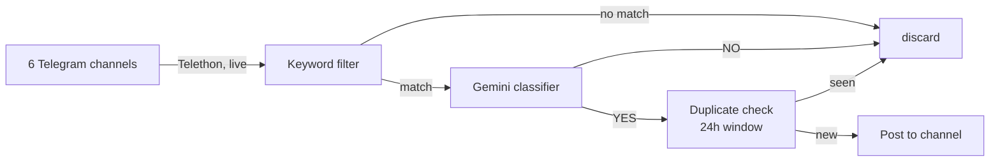

# News Tracker

Watches Ukrainian Telegram news channels and forwards only the posts that describe
**changes to mobilization, conscription, or border-exit rules for men aged 18–22**
into a Telegram channel.

Most Ukrainian news channels post dozens of times a day. This filters that firehose
down to the handful of posts that actually change the rules for one specific group.

## How it works



1. **Read** — [`main.py`](main.py) connects as a *personal Telegram account* (via
   [Telethon](https://docs.telethon.dev/)) and listens for new posts in the channels
   listed in [`channels.py`](channels.py). A personal account is required here: bots
   cannot read channels they don't administer.
2. **Keyword filter** — [`filters.py`](filters.py) does a cheap substring match
   (`мобілізац`, `відстрочк`, `ТЦК`, `кордон`, …). This discards ~99% of posts without
   spending an API call.
3. **Classify** — surviving posts go to Google Gemini with a prompt that asks one
   question: does this describe a rule change affecting men 18–22? The keyword stage
   deliberately over-matches; this stage removes the false positives.
4. **Deduplicate** — [`storage.py`](storage.py) hashes the post and skips anything
   already seen in the last 24 hours, since breaking news gets reposted across channels.
5. **Publish** — [`notifier.py`](notifier.py) posts an excerpt plus a link to the
   original into the destination channel, via a bot.

Every decision (YES and NO, with the model's reasoning) is logged to a local SQLite
database, so the filter's behaviour can be audited after the fact.

## Staying alive

The tracker is a long-running process, so the interesting failure is not "it crashed"
but "it died quietly and nobody noticed." Two independent layers cover that:

| Layer | Catches | How you find out |
|---|---|---|
| **[healthchecks.io](https://healthchecks.io) dead man's switch** | Server offline, network down, process hung, event loop stuck | The process checks in every 5 minutes. If check-ins stop, healthchecks.io (external infrastructure) messages you. |
| **systemd `OnFailure=`** | Process crashed while the server is still up | [`alert_failure.py`](alert_failure.py) DMs you the cause, then re-checks 15 minutes later and reports whether it recovered on its own. |

The first layer is the important one: a heartbeat *sent by* the app can never report the
app's own death. Inverting it — the app checks in, and something external notices silence
— is what makes "the server is gone" detectable.

The check-in is gated on `client.is_connected()`, so a process that is technically alive
but silently disconnected from Telegram still trips the alarm instead of looking healthy.

Alerts go to a **separate bot** in a private DM, keeping operational noise out of the
public channel.

## Project structure

| File | Purpose |
|---|---|
| [`main.py`](main.py) | Event loop, message handler, healthcheck ping |
| [`channels.py`](channels.py) | The list of monitored source channels |
| [`filters.py`](filters.py) | Keyword list, Gemini prompt, rate limiter |
| [`storage.py`](storage.py) | SQLite decision log and 24h deduplication |
| [`notifier.py`](notifier.py) | Sends channel posts and alert DMs |
| [`alert_failure.py`](alert_failure.py) | Failure alert with follow-up, run by systemd |
| [`selftest.py`](selftest.py) | Pre-deploy checks for config, bots, and delivery |
| [`deploy/`](deploy/) | systemd unit files |

## Setup

**Requirements:** Python 3.9+ (Gemini SDK requirement), a Telegram account, and a
Google AI Studio API key.

**1. Telegram API credentials** — sign in at [my.telegram.org](https://my.telegram.org)
→ API development tools, and create an app to get an API ID and hash. These identify
*your account*, which is what reads the source channels.

**2. Two bots** — message [@BotFather](https://t.me/BotFather), run `/newbot` twice:
one bot to publish into the channel, one to DM you alerts. Keep the tokens.

**3. Destination channel** — create a Telegram channel, add the publishing bot as an
**administrator** with *Post Messages* permission (a bot cannot post otherwise). To find
the channel's ID, post a message there, then call:

```bash
curl -s "https://api.telegram.org/bot<NEWS_BOT_TOKEN>/getUpdates"
```

Look for `"chat":{"id":-100…}`. Channel IDs are negative and prefixed with `-100`.

For the alert bot, send it a message first (bots cannot open a conversation), then run
the same call against its token. Your personal chat ID is a positive number.

**4. Dead man's switch** — create a check at [healthchecks.io](https://healthchecks.io),
set **Period** to 5 minutes and **Grace Time** to 10 minutes (matching `PING_INTERVAL`
in `main.py`, tolerating two missed pings before alerting). Copy its ping URL.

To route its alerts through your own alert bot, add a webhook integration with method
`GET` and this URL, filling in your own values:

```
https://api.telegram.org/bot<ALERT_BOT_TOKEN>/sendMessage?chat_id=<ALERT_CHAT_ID>&text=$NAME%20is%20$STATUS
```

**5. Configure and install:**

```bash
cp .env.example .env      # then fill in every value
python3 -m venv .venv
source .venv/bin/activate
pip install -r requirements.txt
```

**6. Verify before running** — this checks every variable, validates both bot tokens,
sends one real test message to the channel and one DM, and pings healthchecks.io:

```bash
python selftest.py
```

**7. First run** — Telethon will prompt for your phone number and a login code, then
save `news_tracker.session`. Run it interactively once so that prompt can be answered:

```bash
python main.py
```

> **Note:** `news_tracker.session` is a logged-in credential for your Telegram account.
> It is gitignored, and two processes must never use the same session file at once —
> Telegram may invalidate it.

## Deployment

Copy the unit files, then enable the service:

```bash
sudo cp deploy/news-tracker.service deploy/news-tracker-alert@.service /etc/systemd/system/
sudo systemctl daemon-reload
sudo systemctl enable --now news-tracker
systemctl status news-tracker
journalctl -u news-tracker -f
```

The unit files assume the project lives at `/home/ubuntu/news-tracker` and runs as
`ubuntu`; adjust `User`, `WorkingDirectory`, and `ExecStart` if yours differs. `-u` on
`ExecStart` keeps Python's output unbuffered so logs reach the journal immediately.

The alert unit needs permission to read the journal — on Ubuntu the default user is
already in the `adm` group, which grants it.

## Updating

```bash
# locally
git commit -am "…" && git push

# on the server
cd ~/news-tracker && git pull && sudo systemctl restart news-tracker
```

`.env`, the session file, and the database are gitignored, so they survive updates
untouched.

## Configuration reference

| Variable | What it is |
|---|---|
| `TELEGRAM_API_ID` / `TELEGRAM_API_HASH` | Your personal account's API credentials, used to *read* channels |
| `NEWS_BOT_TOKEN` / `NEWS_CHAT_ID` | Bot that publishes, and the channel it publishes to (negative ID) |
| `ALERT_BOT_TOKEN` / `ALERT_CHAT_ID` | Bot that DMs you alerts, and your own chat ID (positive) |
| `HEALTHCHECK_URL` | healthchecks.io ping URL |
| `LLM_API_KEY` | Google Gemini API key |

Tuning knobs live at the top of their modules: `KEYWORDS` and the prompt in
`filters.py`, `PING_INTERVAL` in `main.py`, `FOLLOWUP_DELAY` in `alert_failure.py`,
and the monitored channel list in `channels.py`.
