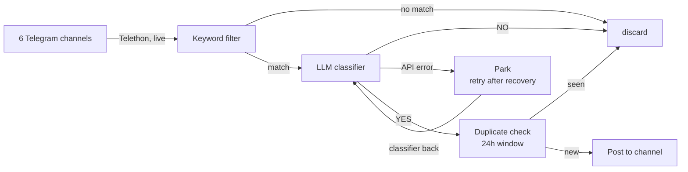

# News Tracker

Watches Ukrainian Telegram news channels and forwards only the posts that describe
**changes to mobilization, conscription, or border-exit rules for men aged 18–22**
into a Telegram channel.

Most Ukrainian news channels post dozens of times a day. This filters that firehose
down to the handful of posts that actually change the rules for one specific group.

## How it works



1. **Read** — [`main.py`](main.py) connects as a *personal Telegram account* (via
   [Telethon](https://docs.telethon.dev/)) and listens for new posts in the channels
   listed in [`channels.py`](channels.py). A personal account is required here: bots
   cannot read channels they don't administer.
2. **Keyword filter** — [`filters.py`](filters.py) does a cheap substring match on word
   stems (`мобілізац`, `відстроч`, `ТЦК`, `кордон`, …), plus a regex for age brackets
   that overlap 18–22 in any format (`18-22`, `від 18 до 60`, `22-річних`). Matching
   brackets by regex rather than by literal string is what lets a post about men
   "18–60" reach the classifier at all. This discards ~99% of posts without spending
   an API call.
3. **Classify** — surviving posts go to an LLM with a prompt that asks one question:
   does this describe a rule change affecting men 18–22? The keyword stage deliberately
   over-matches; this stage removes the false positives. This repo ships configured for
   **Gemini via Google AI Studio** (generous free tier), but the approach is
   provider-agnostic — any LLM API works identically, since it's just "send a prompt,
   parse a YES/NO answer." Swapping providers means replacing the client call in
   `_generate()` ([`filters.py`](filters.py)) with that provider's SDK (OpenAI,
   Anthropic Claude, a self-hosted model via Ollama, etc.) — the prompt template,
   keyword pre-filter, and response parsing don't change.

   Gemini's most common failure is a 503 "high demand" on one model while others
   are fine, so the classifier uses an ordered chain of models (`_MODELS` in
   [`filters.py`](filters.py)): `gemini-3.1-flash-lite` first, then
   `gemini-3.5-flash-lite`, `gemini-3.6-flash`, `gemini-3.5-flash`, `gemini-3.7-flash`,
   `gemini-3.8-flash`. Any error on one model moves straight on to the next with no
   wait, and the first answer wins; the decision log notes `(via <model>)` whenever a
   fallback answered. The chain mixes generations and tiers so its models are unlikely
   to be saturated at once, with the newest Flash — where demand piles up — last.
   Free-tier rate limits are per model, so the same chain also rides out a 429 on one
   model.

   If every model in the chain fails, the post is still **not** judged NO. The whole
   chain is retried — after 60s/120s if rate-limited, otherwise 30s/60s —
   and a post that still can't be classified is **parked** in `decisions.db`
   (`pending_posts`) instead of logged. Once the classifier answers again, a drain
   loop in [`main.py`](main.py) replays every parked post through the classifier for
   real; a YES among them is published late, with its original timestamp. The drain
   never replays into a classifier that is still down, so an outage of any length
   can't use up a post's retries. A post that fails 5 times *while the classifier is
   otherwise healthy* is genuinely broken, and is dropped with a DM quoting it.
4. **Deduplicate** — [`storage.py`](storage.py) hashes the post and skips anything
   already seen in the last 24 hours, since breaking news gets reposted across channels.
5. **Publish** — [`notifier.py`](notifier.py) posts an excerpt, the post's original
   timestamp (always labeled "за Києвом" — Kyiv time, regardless of the server's own
   timezone), and a link to the original, into the destination channel, via a bot.

Every LLM decision (YES and NO, with the model's reasoning) is logged to a local SQLite
database, so the classifier's behaviour can be audited after the fact. Posts stopped
earlier, at the keyword-filter stage, never reach this table — they only ever show up as
a `[SKIP]` line in `journalctl`/stdout, so "why wasn't this post in `decisions.db`" is
often answered by "it never reached the classifier" rather than by a classifier mistake.
Posts parked during an outage appear in `decisions` only once they are classified, with
the reason prefixed `(late)`; a parked post given up on is logged with a reason starting
`dropped after`.

## Staying alive

The tracker is a long-running process, so the interesting failure is not "it crashed"
but "it died quietly and nobody noticed." Three independent layers cover that, and they
deliberately watch different things — each one catches a failure the others structurally
can't see:

| Layer | Catches | How you find out |
|---|---|---|
| **Dead man's switch** ([healthchecks.io](https://healthchecks.io) in this repo) | Server offline, network down, process hung, event loop stuck — anything that stops the heartbeat, including cases where nothing on the box can run code at all | The process checks in every 5 minutes. If check-ins stop for 15 minutes, healthchecks.io DMs you **and** posts to the channel (its own webhook integration — see below). It also posts to the channel the moment check-ins resume. |
| **systemd `ExecStopPost=`** | Process crashed while the server is still up | [`alert_failure.py`](alert_failure.py) DMs you the cause immediately (cooled down to at most once per 10 minutes, so a crash loop can't turn into ~150 DMs) and writes a marker file. On its next successful start, `main.py` sees the marker and sends its own "back up" DM — a crash-and-restart is typically over in seconds, far faster than healthchecks.io's ~15 min detection window, so recovery can't wait on the switch for this case. This layer is private-only on purpose: telling the channel about an outage is the switch's job, since it also catches this same failure (the process stopping) whenever the process manages to check in at least once per restart, which a crash loop usually does. |
| **LLM outage escalation** | The LLM API is down or exhausted — the process itself, and its Telegram connection, are both fine | The switch can't see this: pings keep flowing on schedule regardless of whether the classifier is working, since checking in doesn't touch the LLM at all. So this is the one channel notice that has to come from inside the process. [`filters.py`](filters.py) DMs after 2 consecutive classification failures (fast — not gated on 15 minutes) and, if the outage is still going 15 minutes after the *first* of those failures, posts to the channel too. From the first failure a background probe calls the API once a minute, so both the 15-minute channel notice and recovery are detected on time even when no posts arrive. Recovery (DM and channel) is announced within about a minute of the API answering again, and parked posts are then classified. |

Why tell the channel at all: to a subscriber, "the bot is down" and "nothing has changed
in the rules" look identical — both are an empty channel. That ambiguity is the whole
problem this project exists to solve, so an outage long enough to be mistaken for calm
has to say so out loud. 15 minutes is the threshold in both cases that reach the channel,
so subscribers learn about a real outage on roughly the same timescale no matter which
of the two it is.

These two channel-facing layers were kept deliberately separate rather than merged into
one, because they watch genuinely different things and merging them would either miss
failures or double up on the same one. The switch only knows "no heartbeat"; it cannot
tell a dead classifier from a fine one, because the heartbeat doesn't touch the
classifier. [`filters.py`](filters.py) only knows about classification calls; it has no
way to know if the server itself is gone. Handing *both* jobs to the switch would drop
the LLM case; handing *both* to the process would drop the "process can't even run
`alert_failure.py`" case (e.g. the whole server is down). Each layer's 15-minute clock
is also measured differently for the same reason: the switch's clock is wall-clock time
since the last ping, restarted by nothing; the classifier's clock is wall-clock time
since the *first* consecutive failure, checked on every failed classification and once a
minute by the probe. The probe only runs during an outage — one tiny call per minute,
while real posts are being parked rather than spending quota — so a healthy classifier
costs nothing extra.

The first layer is the important one: a heartbeat *sent by* the app can never report the
app's own death. Inverting it — the app checks in, and something external notices silence
— is what makes "the server is gone" detectable. This repo uses healthchecks.io (generous
free tier, easy Telegram + webhook integrations), but the mechanism is generic — any
service that accepts a periodic HTTP ping and alerts on silence works the same way
(Cronitor, Better Uptime, UptimeRobot's heartbeat monitors, a self-hosted alternative, …).
Unlike the LLM, swapping this needs **no code change at all** — just point
`HEALTHCHECK_URL` at the new ping URL and update the integrations on that service's side.

**Setting up the channel webhook:** in healthchecks.io, add a second integration to the
same check — Integrations → Add Integration → Webhook — independent of whatever
integration already DMs you. Configure its request bodies as JSON POSTs to
`https://api.telegram.org/bot<NEWS_BOT_TOKEN>/sendMessage`, with
`{"chat_id": "<NEWS_CHAT_ID>", "text": "⚠️ Бот тимчасово не працює"}` on failure and
`{"chat_id": "<NEWS_CHAT_ID>", "text": "✅ Бот знову працює"}` on recovery, then enable
the new integration on the check itself (the existing one stays on, untouched). The
message text is a plain constant in this repo ([`filters.py`](filters.py)'s
`CHANNEL_DOWN_MESSAGE`/`CHANNEL_UP_MESSAGE`) — if you change the wording there, update the
webhook's request bodies to match, since the two aren't wired together.

The check-in is gated on `client.is_connected()`, so a process that is technically alive
but silently disconnected from Telegram still trips the alarm instead of looking healthy.

Alerts go to a **separate bot** in a private DM, keeping operational noise out of the
public channel.

### What the recovery DM actually tells you

The generic "X is down" / "X is up" messages healthchecks.io sends itself carry no detail
beyond that — it only ever sees ping silence, never *why* the pings stopped, so no amount
of configuration on its side can add a cause. Anything more specific has to come from
inside the process, which means it can only exist for failures the process survives to
report on. [`main.py`](main.py) combines two such sources into a single "Back to normal"
DM on its next successful start:

- **The process crashed, OS stayed up** — `.last_failure`, written by `alert_failure.py`
  (see above). Reports the same cause already sent in the TRACKER DOWN DM.
- **The server itself rebooted** — detected by comparing `/proc/sys/kernel/random/boot_id`
  against the value saved on the previous run (`.boot_id`). A changed boot ID means the
  kernel restarted, not just the tracker process — the one outage `alert_failure.py`
  can't report on, since a dead OS never gets to run `ExecStopPost=` and explain itself.
  When detected, `main.py` also pulls the last 20 lines of `journalctl -b -1` — the log
  from the boot *before* this one, i.e. whatever the kernel managed to write on its way
  down (OOM-killer, kernel panic, a clean shutdown request, …).

If both happened in the same outage, one DM reports both rather than sending two.

**This needs persistent journal storage to say anything for the reboot case.** Ubuntu's
default is often volatile storage (`/run/log/journal`), which is wiped on every reboot —
so by the time the tracker restarts, the very log it wants to read is already gone, and
the DM says so explicitly instead of silently omitting the section. To enable it:

```bash
sudo mkdir -p /var/log/journal
sudo systemctl restart systemd-journald
```

Do this once, before you need it — it can't retroactively recover logs from before it was
enabled.

### A simpler alternative: daily heartbeat

An earlier version of this project skipped all of the above and just had the bot send a
"No relevant updates today" message at a fixed time (21:00 Kyiv) whenever nothing had
been found that day — proof of life once a day, with no second bot, no external service,
and no systemd changes.

**Trade-off:** downtime can go unnoticed for up to 24 hours instead of ~15 minutes, and
a message that never arrives is ambiguous between "genuinely nothing happened" and "it
crashed sometime after the last one." But it's a fraction of the setup, and reasonable if
daily-granularity confirmation is all you need.

To bring it back, add to [`storage.py`](storage.py):

```python
def has_yes_today() -> bool:
    """True if any YES decision was logged since midnight Kyiv time today."""
    from zoneinfo import ZoneInfo
    midnight_kyiv = (
        datetime.now(ZoneInfo("Europe/Kyiv"))
        .replace(hour=0, minute=0, second=0, microsecond=0)
        .astimezone(timezone.utc)
        .isoformat()
    )
    with sqlite3.connect(DB_PATH) as conn:
        row = conn.execute(
            "SELECT 1 FROM decisions WHERE llm_decision='YES' AND timestamp >= ? LIMIT 1",
            (midnight_kyiv,),
        ).fetchone()
    return row is not None
```

and to [`main.py`](main.py) (using `send_text()`, already defined in
[`notifier.py`](notifier.py) but otherwise unused):

```python
from datetime import timedelta
from zoneinfo import ZoneInfo
from storage import has_yes_today
from notifier import send_text

_KYIV = ZoneInfo("Europe/Kyiv")

async def daily_heartbeat(loop: asyncio.AbstractEventLoop) -> None:
    while True:
        now = datetime.now(_KYIV)
        target = now.replace(hour=21, minute=0, second=0, microsecond=0)
        if now >= target:
            target += timedelta(days=1)
        await asyncio.sleep((target - now).total_seconds())
        if not has_yes_today():
            await loop.run_in_executor(None, send_text, "No relevant updates today.")

# inside main(), alongside the healthcheck_ping task:
asyncio.create_task(daily_heartbeat(loop))
```

## Alert reference

| Alert | Means | Triggered by | Debug |
|---|---|---|---|
| ⚠️ Update may be missed | A relevant post was found but publishing it to the channel failed (marked `(late)` if it was a post rescued from parking) | [`main.py`](main.py)'s `_publish()`, shared by the live handler and the drain, when `send_notification()` raises (bot lost admin/post rights, channel deleted, network blip, rate limit) | The alert links directly to the missed post. Then check `journalctl -u news-tracker -n 50 --no-pager` around that time; verify the news bot is still an admin with *Post Messages*. |
| ⚠️ TRACKER DOWN *(DM only)* | The whole process crashed or was killed | systemd's `ExecStopPost=` running [`alert_failure.py`](alert_failure.py) whenever `$SERVICE_RESULT != "success"`, cooled down to at most once per 10 minutes per outage | The alert's log excerpt is often enough. Otherwise: `systemctl status news-tracker` for the exit code, `journalctl -u news-tracker -n 50 --no-pager` for the full traceback. |
| ✅ Back to normal *(DM only)* | Recovered after a TRACKER DOWN, a server reboot, or both | [`main.py`](main.py) at startup — see "What the recovery DM actually tells you" below | Nothing to do. If DOWN arrived but this never did, `systemctl status news-tracker` — it likely crashed again before finishing startup. |
| healthchecks.io "is down" / "is up" *(DM + posted to the channel)* | The server may be unreachable, or the process is frozen (not crashed — systemd still sees it as running, so TRACKER DOWN won't fire for this case) — or anything else that stops check-ins, including the whole server being gone | Missed check-ins for ~15 min (5 min period + 10 min grace); the channel side is the webhook integration set up above | If you can't SSH in at all, check the Oracle Cloud console first. If you can, look for `[PING] failed to reach healthchecks.io` in the logs — that points to connectivity to that one host, not a full outage. |
| ⚠️ CLASSIFIER DOWN / ✅ Classifier recovered *(DM, fast)* | The LLM API is failing — the process itself is fine | [`filters.py`](filters.py), after 2 consecutive `llm_classify()` failures, each meaning *every* model in the chain failed, three rounds in a row. Recovery comes from the first success — a real post or the once-a-minute probe | `journalctl -u news-tracker \| grep -E "LLM\|PARK\|DRAIN"` shows every failure, probe, park and replay with timestamps. `sqlite3 decisions.db "select count(*) from pending_posts;"` shows how many posts are waiting. For Gemini specifically, check quota/billing at aistudio.google.com — for another provider, check theirs. |
| ⚠️/✅ Бот тимчасово не працює / Бот знову працює *(posted to the channel — LLM outage only)* | The same LLM outage as above has now lasted 15+ minutes measured from the first failure, so subscribers are told the channel's silence may not mean "no news" | [`filters.py`](filters.py)'s `_maybe_alert_channel_outage()` (from a failed classification or the probe) / `_note_llm_success()` | You will already have a CLASSIFIER DOWN DM from when this started; debug from that — check Gemini's quota/billing dashboard. |
| ⚠️ Post could not be classified *(DM only)* | A parked post failed 5 times even though the classifier was healthy each time — something about that post, not the provider — and was dropped unreviewed | [`main.py`](main.py)'s `drain_pending()` | The DM quotes the post; read it yourself. `journalctl -u news-tracker \| grep DRAIN` shows each attempt's error. |
| Channel resolution `FAIL` *(log only — no alert)* | A monitored channel couldn't be resolved at startup (renamed, deleted, or account removed from it) | [`main.py`](main.py)'s `resolve_channels()`, once per start | `journalctl -u news-tracker \| grep FAIL` right after a restart. Not wired to an alert — it only affects that one channel, silently, for the rest of that run, so check this manually after any restart or if a source channel seems to have gone quiet. |

## Project structure

| File | Purpose |
|---|---|
| [`main.py`](main.py) | Event loop, message handler, publishing, parked-post drain, healthcheck ping |
| [`channels.py`](channels.py) | The list of monitored source channels |
| [`filters.py`](filters.py) | Keyword list, LLM prompt, rate limiter, LLM-outage alerts |
| [`storage.py`](storage.py) | SQLite decision log, 24h deduplication, parked posts |
| [`notifier.py`](notifier.py) | Sends channel posts and alert DMs |
| [`alert_failure.py`](alert_failure.py) | Failure alert, run by systemd on every non-clean stop |
| [`selftest.py`](selftest.py) | Pre-deploy checks for config, bots, and delivery |
| [`deploy/`](deploy/) | systemd unit files |

## Setup

**Requirements:** Python 3.9+, a Telegram account, and an API key for an LLM provider.
This repo ships configured for **Gemini via [Google AI Studio](https://aistudio.google.com)**
(free tier is generous and plenty for this volume of traffic) — see the note in
[How it works](#how-it-works) if you'd rather use OpenAI, Anthropic Claude, or a
self-hosted model instead.

**1. Telegram API credentials** — sign in at [my.telegram.org](https://my.telegram.org)
→ API development tools, and create an app to get an API ID and hash. These identify
*your account*, which is what reads the source channels.

**2. Two bots** — message [@BotFather](https://t.me/BotFather), run `/newbot` twice:
one bot to publish into the channel, one to DM you alerts. Keep the tokens.

**3. Destination channel** — create a Telegram channel, add the publishing bot as an
**administrator** with *Post Messages* permission (a bot cannot post otherwise). To find
the channel's ID, post a message there, then call:

```bash
curl -s "https://api.telegram.org/bot<NEWS_BOT_TOKEN>/getUpdates"
```

Look for `"chat":{"id":-100…}`. Channel IDs are negative and prefixed with `-100`.

For the alert bot, send it a message first (bots cannot open a conversation), then run
the same call against its token. Your personal chat ID is a positive number.

**4. Dead man's switch** — create a check at [healthchecks.io](https://healthchecks.io)
(or any equivalent service, see [Staying alive](#staying-alive)), set **Period** to
5 minutes and **Grace Time** to 10 minutes (matching `PING_INTERVAL` in `main.py`,
tolerating two missed pings before alerting). Copy its ping URL.

To route its alerts through your own alert bot, add a webhook integration with method
`GET` and this URL, filling in your own values:

```
https://api.telegram.org/bot<ALERT_BOT_TOKEN>/sendMessage?chat_id=<ALERT_CHAT_ID>&text=$NAME%20is%20$STATUS
```

This gives you the private DM side. Also add a **second** integration on the same check
so subscribers learn about a real outage too — see "Setting up the channel webhook" under
[Staying alive](#staying-alive) for its exact request bodies. Easy to miss if you only do
the first one: the two are independent, and neither implies the other.

**5. Configure and install:**

```bash
cp .env.example .env      # then fill in every value
python3 -m venv .venv
source .venv/bin/activate
pip install -r requirements.txt
```

**6. Verify before running** — this checks every variable, validates both bot tokens,
sends one real test message to the channel and one DM, and pings healthchecks.io:

```bash
python selftest.py
```

**7. First run** — Telethon will prompt for your phone number and a login code, then
save `news_tracker.session`. Run it interactively once so that prompt can be answered:

```bash
python main.py
```

> **Note:** `news_tracker.session` is a logged-in credential for your Telegram account.
> It is gitignored, and two processes must never use the same session file at once —
> Telegram may invalidate it.

## Deployment

Copy the unit files, then enable the service:

```bash
sudo cp deploy/news-tracker.service /etc/systemd/system/
sudo systemctl daemon-reload
sudo systemctl enable --now news-tracker
systemctl status news-tracker
journalctl -u news-tracker -f
```

The unit files assume the project lives at `/home/ubuntu/news-tracker` and runs as
`ubuntu`; adjust `User`, `WorkingDirectory`, and `ExecStart` if yours differs. `-u` on
`ExecStart` keeps Python's output unbuffered so logs reach the journal immediately.

`alert_failure.py` needs permission to read the journal — on Ubuntu the default user is
already in the `adm` group, which grants it. It only sends a message when the stop was
not a deliberate `systemctl stop` (checked via systemd's `$SERVICE_RESULT`).

Also enable persistent journal storage, so the recovery DM has a previous-boot log to
read from after a real server reboot (see [Staying alive](#staying-alive) for why this
matters — it's the one detail `alert_failure.py` can't cover on its own):

```bash
sudo mkdir -p /var/log/journal
sudo systemctl restart systemd-journald
```

## Updating

```bash
# locally
git commit -am "…" && git push

# on the server
cd ~/news-tracker && git pull && sudo systemctl restart news-tracker
```

`.env`, the session file, and the database are gitignored, so they survive updates
untouched.

## Configuration reference

| Variable | What it is |
|---|---|
| `TELEGRAM_API_ID` / `TELEGRAM_API_HASH` | Your personal account's API credentials, used to *read* channels |
| `NEWS_BOT_TOKEN` / `NEWS_CHAT_ID` | Bot that publishes, and the channel it publishes to (negative ID) |
| `ALERT_BOT_TOKEN` / `ALERT_CHAT_ID` | Bot that DMs you alerts, and your own chat ID (positive) |
| `HEALTHCHECK_URL` | Ping URL from your dead man's switch service (healthchecks.io by default) |
| `LLM_API_KEY` | API key for your chosen LLM provider (this repo ships configured for Google Gemini) |

Tuning knobs live at the top of their modules: `KEYWORDS` and the prompt in `filters.py`,
`PING_INTERVAL` in `main.py`, and the monitored channel list in `channels.py`. Also in
`filters.py`: `_LLM_CHANNEL_ALERT_AFTER` (the 15-minute threshold for the LLM-outage
channel post) and `CHANNEL_DOWN_MESSAGE`/`CHANNEL_UP_MESSAGE` (the channel wording — keep
these in sync with the healthchecks.io webhook's request bodies, since nothing wires the
two together automatically). In `alert_failure.py`: `_DM_COOLDOWN` (minimum gap between
TRACKER DOWN DMs during a crash loop). For outages: `_MODELS` (the fallback chain and its
order — only add models you have checked return the two-line YES/NO format),
`_RETRYABLE` and `_backoff_seconds()`
(which errors are retried in-call, and how long each wait is) and `_PROBE_INTERVAL` in
`filters.py`; `DRAIN_INTERVAL` in `main.py`; `MAX_PARK_ATTEMPTS` in `storage.py`.

## License

[MIT](LICENSE)
